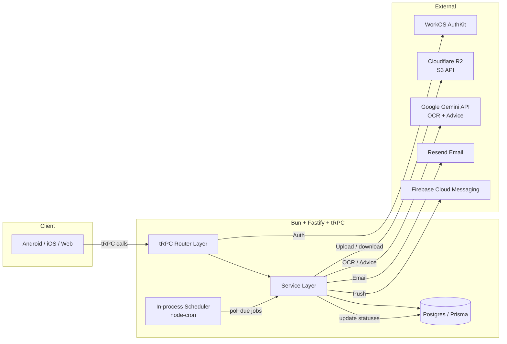

# Health Assistant API — Build Plan

This document captures the long-term implementation plan for the Health Assistant API, based on the existing stack and constraints in this repo.

## Architecture Overview

### High-level diagram



### Data flow (upload → OCR → advice → notify)

- **Upload (sync)**:
  - Auth via **WorkOS** → get `userId`
  - Validate file (type/size)
  - Create `Document` row: `status=PROCESSING`
  - Upload original to **R2** at `users/{userId}/documents/{documentId}/{filename}`
  - Enqueue a DB-backed job: `DOCUMENT_OCR` for `documentId`
  - Return `Document` immediately

- **OCR (async job)**:
  - Scheduler claims `DOCUMENT_OCR` job (row lock)
  - Download from R2 (stream) → send to **Gemini Vision** with a structured prompt
  - Persist:
    - `Document.extractedText`
    - `Document.ocrJson` (typed JSON)
    - `Document.docType`, `Document.language`
    - `Document.status=COMPLETED` (or `FAILED` with reason)
  - Enqueue `DOCUMENT_ADVICE` job

- **Advice (async job)**:
  - Fetch new doc + user’s prior docs (or summaries)
  - Send to **Gemini Text** to produce actionable advice + safety disclaimer
  - Store `AiAdvice`
  - Enqueue `NOTIFY_DOCUMENT_READY`

- **Notify (async job)**:
  - Resolve user notification prefs + device tokens
  - Dispatch via **Resend** and/or **FCM**

### External services map

- **WorkOS**: authenticate requests, map external identity → internal `User`
- **R2**: private object storage (no public buckets)
- **Gemini**: OCR + structured extraction + advice generation
- **Resend**: email notifications (reminders + “doc ready”)
- **FCM**: push notifications (reminders + “doc ready”)

## Prisma Schema Changes (additions only)

> Add these alongside existing models. Do not remove/rename `User`, `Product`, `UserProduct`.

```prisma
// ===== Enums =====
enum DocumentStatus { PROCESSING COMPLETED FAILED DELETED }
enum DocumentType { LAB_RESULT PRESCRIPTION VISIT_SUMMARY UNKNOWN }
enum JobStatus { PENDING RUNNING SUCCEEDED FAILED CANCELLED }
enum JobType { DOCUMENT_OCR DOCUMENT_ADVICE NOTIFY_DOCUMENT_READY REMINDER_DISPATCH CALENDAR_REMINDER_DISPATCH }
enum DevicePlatform { ANDROID IOS WEB }
enum NotificationChannel { EMAIL PUSH }
enum ReminderStatus { SCHEDULED SNOOZED TAKEN DISMISSED EXPIRED }
enum NotificationPreference { EMAIL_ONLY PUSH_ONLY BOTH NONE }

// ===== Documents =====
model Document {
  id              String         @id @default(cuid())
  userId          String
  status          DocumentStatus @default(PROCESSING)
  type            DocumentType   @default(UNKNOWN)
  language        String?        // e.g. "en", "vi", "unknown"
  originalName    String
  contentType     String         // "application/pdf", "image/png", ...
  sizeBytes       Int
  storageBucket   String         // R2 bucket name (env-driven)
  storageKey      String         @unique // users/{userId}/documents/{id}/{filename}
  sha256          String?        // optional dedupe/audit
  extractedText   String?        // OCR full text (maybe large)
  ocrJson         Json?          // structured extraction result
  ocrModel        String?        // e.g. "gemini-2.x"
  ocrPromptVer    Int            @default(1)
  ocrCompletedAt  DateTime?
  failedReason    String?
  createdAt       DateTime       @default(now())
  updatedAt       DateTime       @updatedAt
  deletedAt       DateTime?

  medications     Medication[]
  visitSummary    VisitSummary?
  labResult       LabResult?
  advice          AiAdvice?

  user            User           @relation(fields: [userId], references: [id], onDelete: Cascade)

  @@index([userId, createdAt])
  @@index([userId, status])
  @@index([userId, type])
}

model LabResult {
  id          String   @id @default(cuid())
  documentId  String   @unique
  labName     String?
  collectedAt DateTime?
  reportedAt  DateTime?
  testsJson   Json
  createdAt   DateTime @default(now())

  document    Document @relation(fields: [documentId], references: [id], onDelete: Cascade)
}

model VisitSummary {
  id            String   @id @default(cuid())
  documentId    String   @unique
  clinicName    String?
  doctorName    String?
  diagnosis     String?
  notes         String?
  visitDate     DateTime?
  followUpDate  DateTime?
  createdAt     DateTime @default(now())

  document      Document @relation(fields: [documentId], references: [id], onDelete: Cascade)
}

// ===== AI Advice =====
model AiAdvice {
  id            String   @id @default(cuid())
  userId        String
  documentId    String   @unique
  model         String
  promptVer     Int      @default(1)
  content       String
  highlightsJson Json?
  createdAt     DateTime @default(now())

  user          User     @relation(fields: [userId], references: [id], onDelete: Cascade)
  document      Document @relation(fields: [documentId], references: [id], onDelete: Cascade)

  @@index([userId, createdAt])
}

// ===== Devices & Notification prefs =====
model DeviceToken {
  id          String         @id @default(cuid())
  userId      String
  platform    DevicePlatform
  token       String         @unique
  isActive    Boolean        @default(true)
  lastSeenAt  DateTime?
  createdAt   DateTime       @default(now())
  updatedAt   DateTime       @updatedAt

  user        User           @relation(fields: [userId], references: [id], onDelete: Cascade)

  @@index([userId, platform])
  @@index([userId, isActive])
}

model NotificationSettings {
  id                    String                 @id @default(cuid())
  userId                String                 @unique
  preference            NotificationPreference @default(BOTH)
  timezone              String                 @default("UTC")
  quietHoursStartMin    Int?
  quietHoursEndMin      Int?
  reminderDefaultLeadMin Int   @default(0)
  createdAt             DateTime @default(now())
  updatedAt             DateTime @updatedAt

  user                  User     @relation(fields: [userId], references: [id], onDelete: Cascade)
}

// ===== Medications & Reminders =====
model Medication {
  id            String   @id @default(cuid())
  userId        String
  documentId    String
  name          String
  dosage        String?
  frequency     String?
  durationDays  Int?
  instructions  String?
  startDate     DateTime?
  endDate       DateTime?
  remindersOn   Boolean  @default(false)
  createdAt     DateTime @default(now())
  updatedAt     DateTime @updatedAt

  user          User     @relation(fields: [userId], references: [id], onDelete: Cascade)
  document      Document @relation(fields: [documentId], references: [id], onDelete: Cascade)
  schedules     ReminderSchedule[]
  doses         DoseEvent[]

  @@index([userId, createdAt])
  @@index([documentId])
}

model ReminderSchedule {
  id            String   @id @default(cuid())
  medicationId  String
  timeOfDayMin  Int
  channel       NotificationChannel?
  isActive      Boolean  @default(true)
  createdAt     DateTime @default(now())
  updatedAt     DateTime @updatedAt

  medication    Medication @relation(fields: [medicationId], references: [id], onDelete: Cascade)

  @@unique([medicationId, timeOfDayMin])
  @@index([medicationId, isActive])
}

model DoseEvent {
  id            String         @id @default(cuid())
  userId        String
  medicationId  String
  scheduledFor  DateTime
  status        ReminderStatus @default(SCHEDULED)
  snoozedUntil  DateTime?
  takenAt       DateTime?
  dismissedAt   DateTime?
  createdAt     DateTime       @default(now())
  updatedAt     DateTime       @updatedAt

  user          User           @relation(fields: [userId], references: [id], onDelete: Cascade)
  medication    Medication     @relation(fields: [medicationId], references: [id], onDelete: Cascade)

  @@unique([medicationId, scheduledFor])
  @@index([userId, scheduledFor])
  @@index([status, scheduledFor])
}

// ===== Calendar =====
model CalendarEvent {
  id            String   @id @default(cuid())
  userId        String
  documentId    String?
  title         String
  description   String?
  startsAt      DateTime
  endsAt        DateTime?
  location      String?
  remindLeadMin Int      @default(1440)
  remindLeadMin2 Int?
  isActive      Boolean  @default(true)
  createdAt     DateTime @default(now())
  updatedAt     DateTime @updatedAt
  deletedAt     DateTime?

  user          User     @relation(fields: [userId], references: [id], onDelete: Cascade)
  document      Document? @relation(fields: [documentId], references: [id], onDelete: SetNull)

  @@index([userId, startsAt])
  @@index([userId, isActive])
}

// ===== Background Jobs (DB-backed queue) =====
model Job {
  id            String   @id @default(cuid())
  type          JobType
  status        JobStatus @default(PENDING)
  userId        String?
  documentId    String?
  runAt         DateTime  @default(now())
  attempts      Int       @default(0)
  maxAttempts   Int       @default(5)
  lockedAt      DateTime?
  lockedBy      String?
  lastError     String?
  payload       Json?
  createdAt     DateTime  @default(now())
  updatedAt     DateTime  @updatedAt

  user          User?     @relation(fields: [userId], references: [id], onDelete: Cascade)
  document      Document? @relation(fields: [documentId], references: [id], onDelete: Cascade)

  @@index([status, runAt])
  @@index([type, status, runAt])
  @@index([documentId, type])
}
```

## Project Structure (proposed under `src/`)

```txt
src/
  index.ts
  router.ts
  trpc.ts
  db/
    prisma.ts

  auth/
    workos.ts
    middleware.ts
    userSync.ts

  storage/
    r2.ts
    storageService.ts

  jobs/
    jobRepo.ts
    scheduler.ts
    types.ts

  documents/
    documentSchemas.ts
    documentService.ts
    ocrPrompt.ts
    ocrService.ts
    documentRouter.ts

  ai/
    advicePrompt.ts
    adviceService.ts
    aiRouter.ts
    summarizer.ts

  notifications/
    notificationService.ts
    emailService.ts
    pushService.ts
    templates/

  reminders/
    medicationService.ts
    reminderService.ts
    reminderRouter.ts
    reminderEngine.ts

  calendar/
    calendarService.ts
    ics.ts
    calendarRouter.ts
    calendarEngine.ts

  user/
    userRouter.ts
    userService.ts

  utils/
    env.ts
    errors.ts
    rateLimit.ts
    time.ts
```

## API Routes (tRPC Procedures)

### Auth (authed unless noted)

- `auth.getSession` (query)
  - input: `z.void()`
  - output: `{ user: { id, email, name }, workos: { orgId?, userId? } }`
- `auth.registerDeviceToken` (mutation)
  - input: `{ platform: ANDROID|IOS|WEB, token: string }`
  - output: `{ ok: true }`
- `auth.unregisterDeviceToken` (mutation)
  - input: `{ token: string }`
  - output: `{ ok: true }`

### User

- `user.getProfile` (query)
- `user.updateProfile` (mutation)
- `user.getNotificationPreferences` (query)
- `user.updateNotificationPreferences` (mutation)

### Documents

- `documents.upload` (mutation)
- `documents.list` (query)
- `documents.getById` (query)
- `documents.delete` (mutation)
- `documents.retryProcessing` (mutation)

### AI Advice

- `ai.getByDocument` (query)
- `ai.getHistory` (query)

### Medications

- `medications.list` (query)
- `medications.toggleReminder` (mutation)
- `medications.updateReminderSchedule` (mutation)

### Reminders

- `reminders.list` (query)
- `reminders.markTaken` (mutation)
- `reminders.snooze` (mutation)
- `reminders.dismiss` (mutation)

### Calendar

- `calendar.list` (query)
- `calendar.create` (mutation)
- `calendar.update` (mutation)
- `calendar.delete` (mutation)
- `calendar.downloadIcs` (query)

## Service Layer Design (interfaces)

```ts
export type UserId = string;

export interface StorageService {
  upload(params: {
    bucket: string;
    key: string;
    contentType: string;
    bytes: Uint8Array;
  }): Promise<{ etag?: string }>;

  download(params: { bucket: string; key: string }): Promise<{ bytes: Uint8Array; contentType?: string }>;

  delete(params: { bucket: string; key: string }): Promise<void>;

  getSignedUrl(params: {
    bucket: string;
    key: string;
    expiresInSeconds: number;
    method: "GET" | "PUT";
    contentType?: string;
  }): Promise<{ url: string }>;
}

export type OcrResult = {
  language: string;
  documentType: "LAB_RESULT" | "PRESCRIPTION" | "VISIT_SUMMARY" | "UNKNOWN";
  extractedText: string;
  structured: unknown;
};

export interface OcrService {
  ocrDocument(params: {
    contentType: string;
    bytes: Uint8Array;
    promptVersion: number;
  }): Promise<OcrResult>;
}

export interface AiAdviceService {
  generateAdvice(params: {
    userId: UserId;
    document: { id: string; type: string; extractedText?: string; ocrJson?: unknown };
    history: Array<{ id: string; createdAt: Date; type: string; summaryOrOcr: unknown }>;
    promptVersion: number;
  }): Promise<{ content: string; highlightsJson?: unknown; model: string }>;
}

export interface NotificationService {
  notifyDocumentReady(params: { userId: UserId; documentId: string }): Promise<void>;
  sendReminder(params: { userId: UserId; doseEventId: string }): Promise<void>;
  sendCalendarReminder(params: { userId: UserId; calendarEventId: string }): Promise<void>;
}

export interface EmailService {
  send(params: { to: string; subject: string; text: string }): Promise<void>;
}

export interface PushService {
  send(params: { tokens: string[]; title: string; body: string; data?: Record<string, string> }): Promise<void>;
}

export type JobEnqueue = {
  type:
    | "DOCUMENT_OCR"
    | "DOCUMENT_ADVICE"
    | "NOTIFY_DOCUMENT_READY"
    | "REMINDER_DISPATCH"
    | "CALENDAR_REMINDER_DISPATCH";
  runAt?: Date;
  userId?: string;
  documentId?: string;
  payload?: Record<string, unknown>;
  maxAttempts?: number;
};

export interface SchedulerService {
  enqueue(job: JobEnqueue): Promise<{ jobId: string }>;
  cancel(params: { jobId: string }): Promise<void>;
}

export interface CalendarService {
  generateIcs(params: {
    event: { id: string; title: string; startsAt: Date; endsAt?: Date; description?: string; location?: string };
  }): Promise<{ filename: string; ics: string }>;
}
```

## Implementation Phases

### Phase 1 — Auth & User Foundation

- Add WorkOS integration; add auth middleware; device token registration; user profile endpoints.
- Dependencies: `bun add @workos-inc/node`
- Env vars: `WORKOS_API_KEY`, `WORKOS_CLIENT_ID`, plus any AuthKit JWT/session settings
- Prisma: add `DeviceToken`, `NotificationSettings`
- Verify: authed procedures reject unauth; device tokens stored; profile endpoints work

### Phase 2 — File Upload & R2 Storage

- Add R2 storage service; `documents.upload/list/getById/delete`; `Document` model.
- Dependencies: `bun add @aws-sdk/client-s3 @aws-sdk/s3-request-presigner`
- Env vars: `R2_ENDPOINT`, `R2_ACCESS_KEY_ID`, `R2_SECRET_ACCESS_KEY`, `R2_BUCKET`, `UPLOAD_MAX_BYTES`, `UPLOAD_ALLOWED_CONTENT_TYPES`
- Prisma: add `Document`
- Verify: upload stores in R2 and DB; list/get/delete scoped to user

### Phase 3 — OCR Pipeline

- Add DB-backed jobs (`Job`) + cron worker; Gemini vision OCR; structured extraction; document status updates.
- Dependencies: `bun add node-cron @google/genai`
- Env vars: `GOOGLE_GENAI_API_KEY`, `GEMINI_OCR_MODEL`, `JOB_WORKER_ID`, `JOB_POLL_INTERVAL_SECONDS`
- Prisma: add `Job`; add optional typed tables + `Medication` extraction wiring
- Verify: jobs claim/lock; success updates doc; failures retry + set `FAILED`

### Phase 4 — AI Health Advice

- Gemini text generation with document history context; store `AiAdvice`; notify user “ready”.
- Dependencies: (already) `@google/genai`
- Env vars: `GEMINI_ADVICE_MODEL`, history limits
- Prisma: add `AiAdvice`
- Verify: advice created after OCR; retrievable via API; includes safety disclaimer

### Phase 5 — Prescription & Pill Reminders

- Store meds; allow toggles + schedules; scheduler dispatch; email (Resend) + push (FCM).
- Dependencies: `bun add resend firebase-admin`
- Env vars: `RESEND_API_KEY`, `EMAIL_FROM`, `FCM_SERVICE_ACCOUNT_JSON_BASE64`, reminder cron
- Prisma: `ReminderSchedule`, `DoseEvent` (+ any prefs if needed)
- Verify: due reminders dispatch; actions update dose state and suppress repeats

### Phase 6 — Calendar Events & Re-examination Reminders

- Extract follow-up date; CRUD calendar events; `.ics` generation; scheduled reminders.
- Dependencies: optional `ical-generator` (or minimal hand-rolled ICS)
- Env vars: calendar cron
- Prisma: `CalendarEvent`
- Verify: `.ics` imports; reminders send at lead times

## Environment Variables (to add)

### WorkOS

- `WORKOS_API_KEY=...`
- `WORKOS_CLIENT_ID=...`

### R2

- `R2_ENDPOINT=https://<accountid>.r2.cloudflarestorage.com`
- `R2_ACCESS_KEY_ID=...`
- `R2_SECRET_ACCESS_KEY=...`
- `R2_BUCKET=health-assistant`
- `R2_REGION=auto`

### Upload limits

- `UPLOAD_MAX_BYTES=10485760`
- `UPLOAD_ALLOWED_CONTENT_TYPES=application/pdf,image/png,image/jpeg`

### Gemini

- `GOOGLE_GENAI_API_KEY=...`
- `GEMINI_OCR_MODEL=...`
- `GEMINI_ADVICE_MODEL=...`
- `GEMINI_OCR_PROMPT_VER=1`
- `GEMINI_ADVICE_PROMPT_VER=1`

### Jobs / Scheduler

- `JOB_WORKER_ID=local-dev`
- `JOB_POLL_INTERVAL_SECONDS=5`
- `REMINDER_SCAN_CRON=*/1 * * * *`
- `CALENDAR_REMINDER_SCAN_CRON=*/5 * * * *`

### Resend

- `RESEND_API_KEY=...`
- `EMAIL_FROM="Health Assistant <noreply@yourdomain.com>"`

### FCM

- `FCM_SERVICE_ACCOUNT_JSON_BASE64=...`

## Background Job Architecture (node-cron, swappable later)

- Use a DB-backed queue (`Job` table) and a cron polling loop.
- Claim jobs with row locking (`FOR UPDATE SKIP LOCKED`), set `lockedBy`, `lockedAt`.
- Retry with exponential backoff until `maxAttempts` reached.
- Keep business logic in service methods so swapping to BullMQ is an adapter change only.

## Security Considerations

- Enforce row-level access in every query (`where: { userId: ctx.userId, ... }`).
- Validate upload type and size; do not log extracted medical text.
- Keep R2 objects private; use signed URLs or a proxy route for downloads.
- Rate limit upload and AI-triggering endpoints.
*** End Patch}
